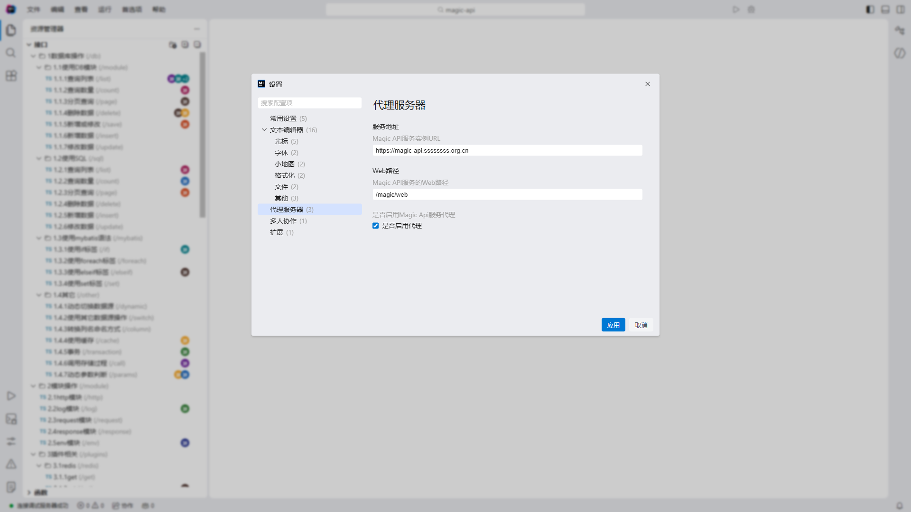
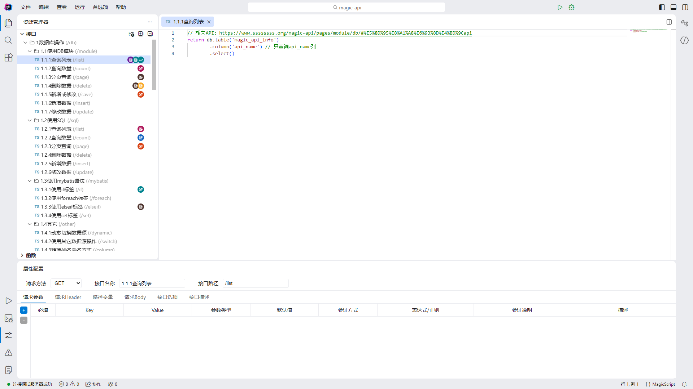
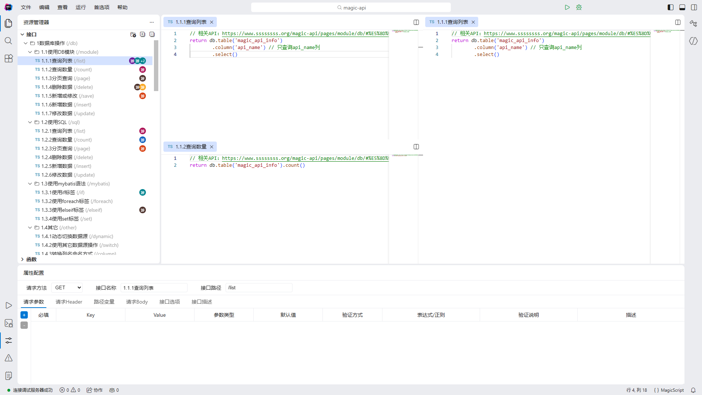
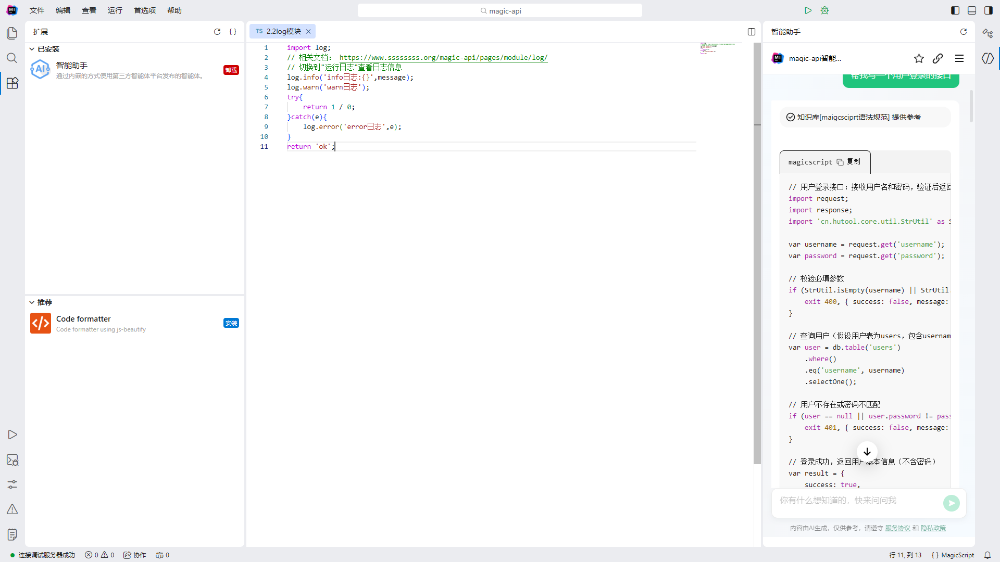
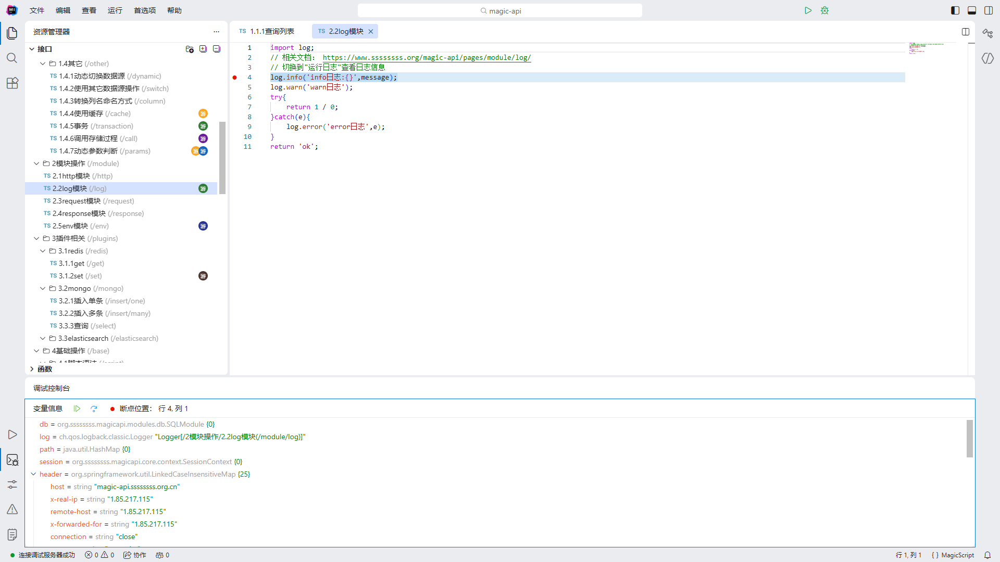
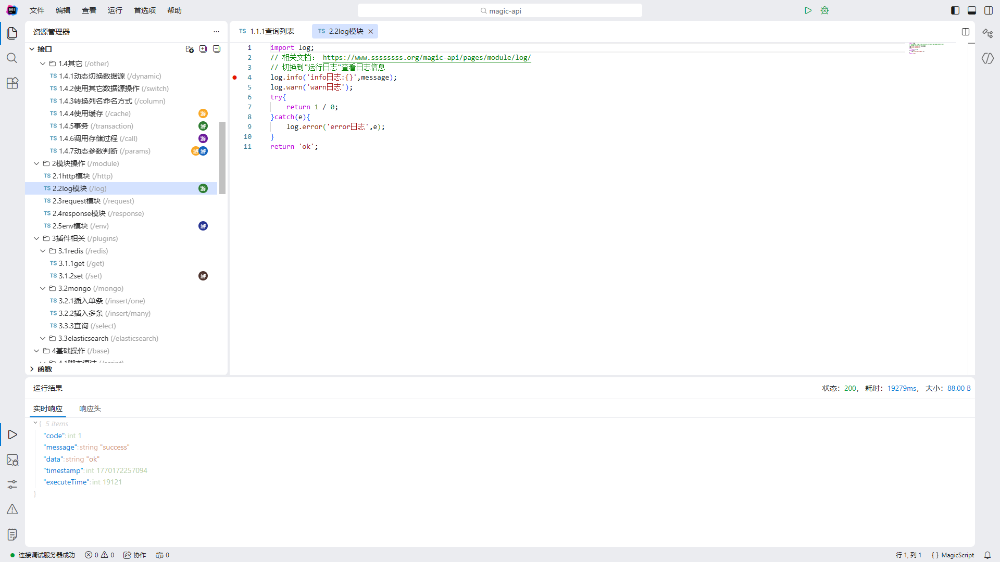
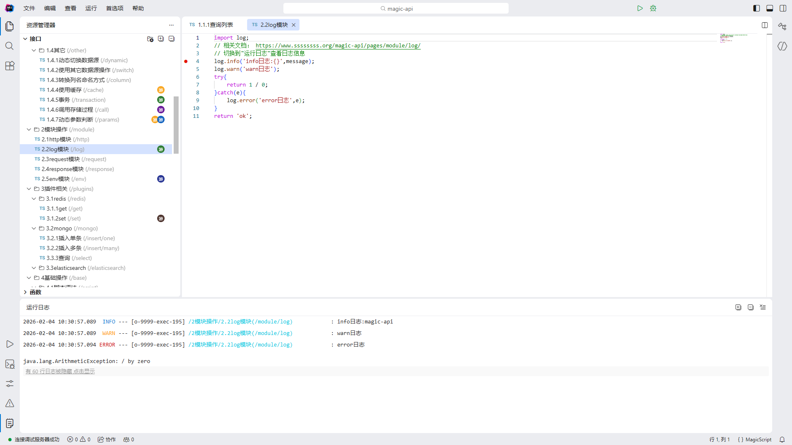
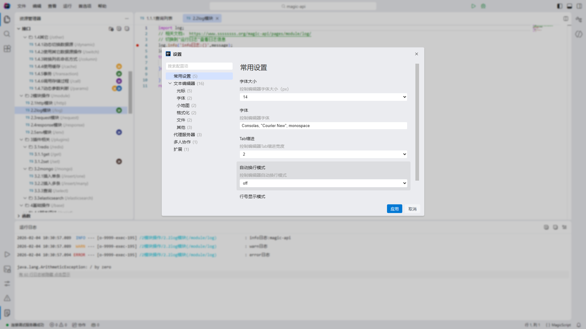

# magic-idea

#### 介绍
magic-idea是一个现代化的代码编辑器，具有丰富的功能面板和可扩展的插件系统，专为开发者设计，提供高效的代码编辑和管理体验。
提供以下核心能力：
- 🌳 可视化文件资源管理
- 🌈 可定制的主题系统
- 📦 可扩展的插件系统
- 🧩 多面板工作界面
- ⚡ 实时代码对比与版本管理(开发中)
- 🔌 多项目管理(开发中)

#### 插件列表
1. 代码格式化插件
2. AI智能问答插件
3. 暗黑主题插件*
4. 多人协同插件*

#### 软件架构
基于react + typescript + antd + monaco-editor等前端组件实现。

#### 体验地址
* [Magic IDEA在线服务](https://magic-idea.dongqifei.deno.net "Magic IDEA在线服务")

#### 项目截图
|  |  |
|---|---|
|  |  |
| |  |
|  |  |
|  |  |

#### 参与贡献

1.  Fork 本仓库
2.  新建 Feat_xxx 分支
3.  提交代码
4.  新建 Pull Request

