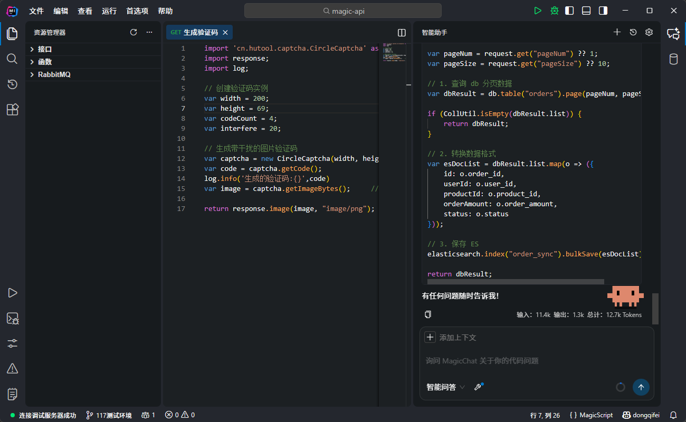
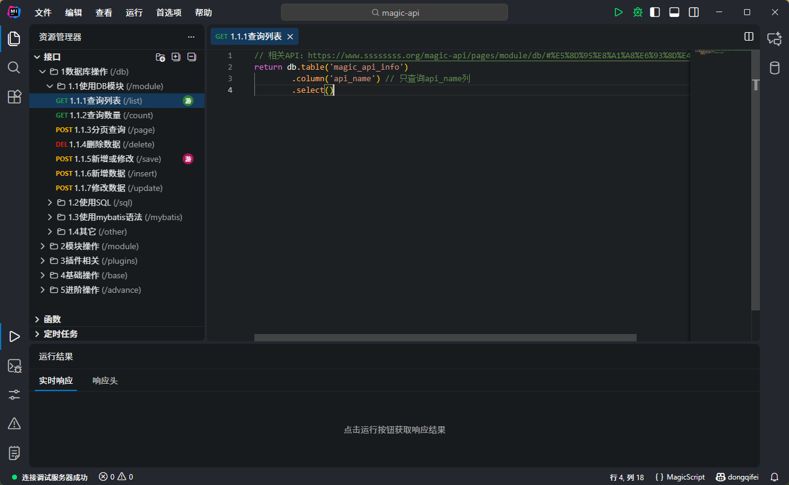
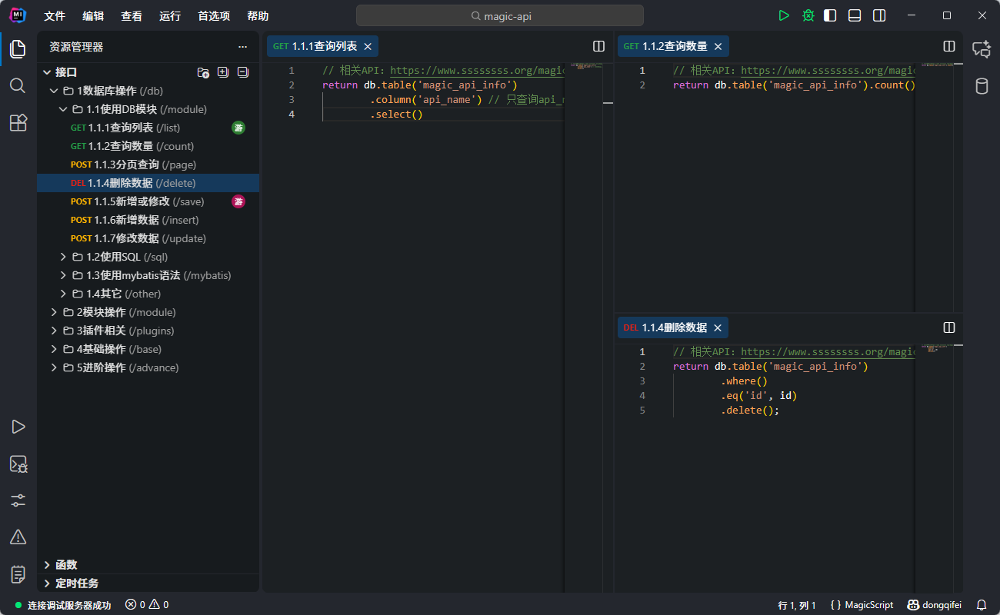
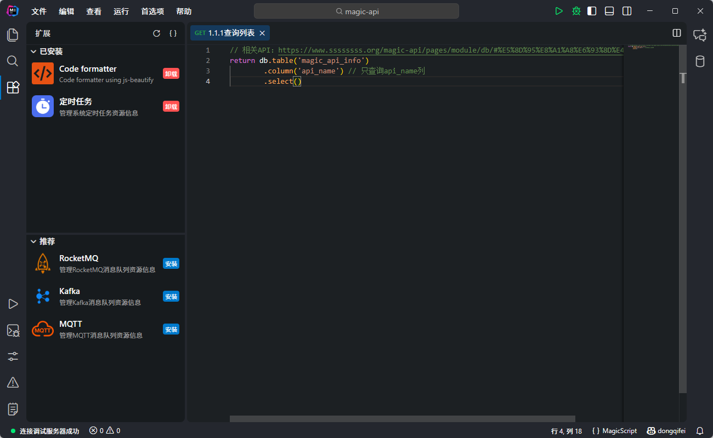
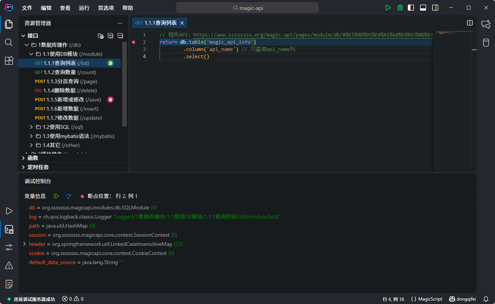
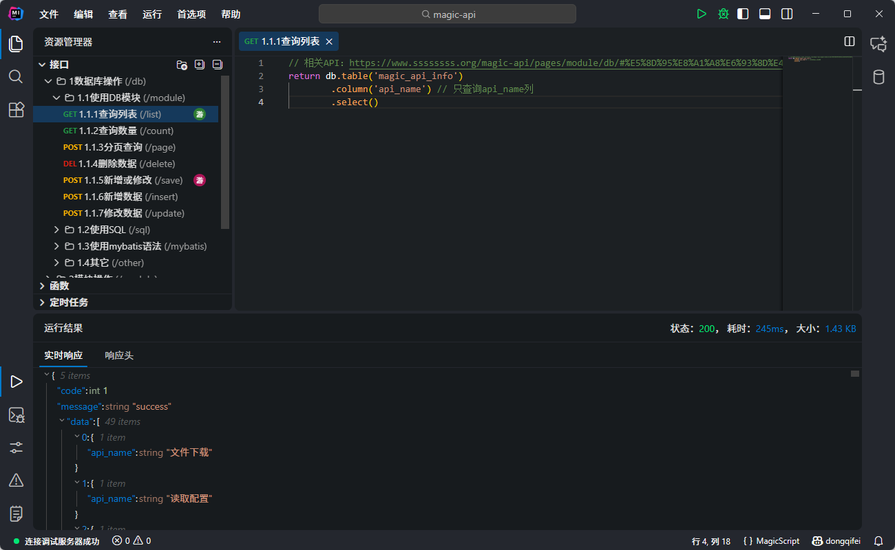
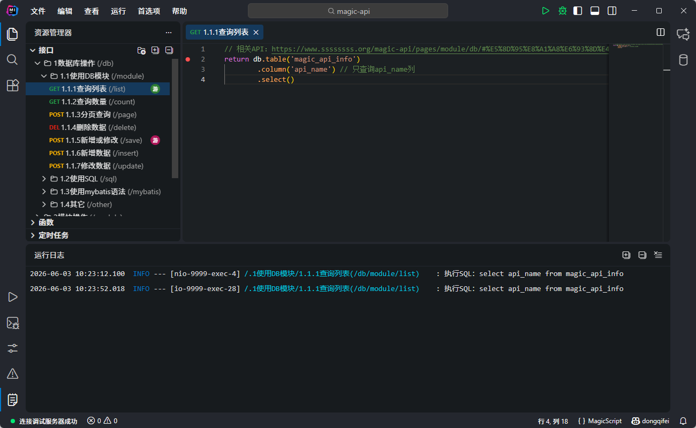
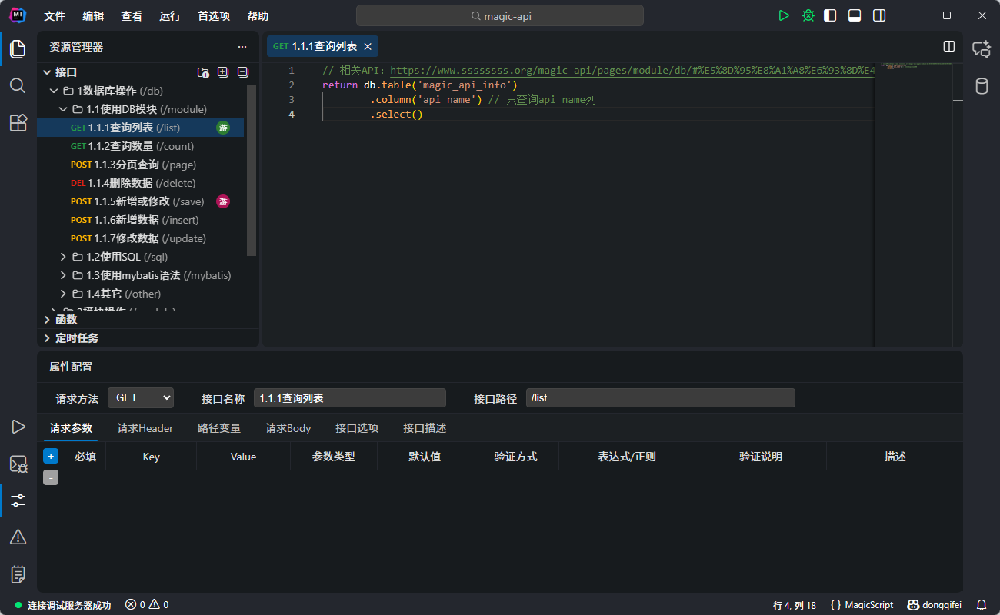

# MagicIDEA 编辑器项目文档

## 项目概述

MagicIDEA 是一个现代化的代码编辑器，具有丰富的功能面板和可扩展的插件系统，专为开发者设计，提供高效的代码编辑和管理体验。
提供以下核心能力：

- 🌳 可视化文件资源管理
- 🌈 可定制的主题系统
- 📦 可扩展的插件系统
- ⚡ 实时代码对比与版本管理
- 🧩 多面板协同工作界面

## 开发指南

### 服务端开发

```shell
npm install
npm run dev
npm run build
node rename.js
```

### web端开发

```shell
cd ./web
npm install
npm run dev
npm run build
```

## 构建桌面应用

### 安装插件

```shell
cd src-tauri
cargo add tauri-plugin-shell tauri-plugin-deep-link tauri-plugin-updater
```

### 启动

```shell
npm run tauri dev
```

### 打包

```shell
$env:TAURI_SIGNING_PRIVATE_KEY=$(Get-Content -Raw "C:\Users\xxxx\.tauri\myapp.key")
npm run tauri build
```

## 项目截图

|  |  |
|---|---|
|  |  |
| |  |
|  |  |

## 学习资料

- [Monaco Editor 译文](https://wf0.github.io/example/plugins/Formatter.html "Monaco Editor 格式化插件文档")
- [Vscode Codicons 文档](https://microsoft.github.io/vscode-codicons/dist/codicon.html "Vscode Codicons 文档")
- [Mini-Star 插件开发](https://ministar.moonrailgun.com/ "MiniStar")
- [react-icons](https://react-icons.github.io/react-icons/icons/vsc/ "react-icons")
- [Ant Design 文档](https://ant-design.antgroup.com/ "Ant Design 文档")
- [lumino 文档](https://lumino.readthedocs.io/en/latest/ "lumino 文档")
- [highlightjs 文档](https://highlightjs.org/ "highlightjs 文档")
- [react-jsonschema-form 文档](https://rjsf-team.github.io/react-jsonschema-form/ "react-jsonschema-form 文档")
- [markdown-to-jsx/react 文档](https://markdown-to-jsx.quantizor.dev/ "markdown-to-jsx/react 文档")
- [file-icons-js 文档](https://github.com/websemantics/file-icons-js "file-icons-js 文档")
- [react-json-view 文档](https://uiwjs.github.io/react-json-view/ "react-json-view 文档")
- [codex-petdex 文档](https://petdex.crafter.run "codex-petdex 文档")
- [Tauri 文档](https://v2.tauri.org.cn/start "Tauri 文档")
- [impeccable 文档](https://impeccable.cn/ "impeccable skills减少ai味")

## 交流群

| 微信群 |
| ----- |
|  |
| 备注：加群，邀您加入群聊 |

## 赞助支持

如果magic-idea帮助到了您，您可以友情支持一下magic-idea，请作者喝杯咖啡(●'◡'●)。

| 微信 | 支付宝 |
| -----  | ----- |
|  |  |

本项目采用 MIT 许可证。MIT License Copyright (c) [2026] [amofly] 权限的详细信息请查看随附的 LICENSE 文件
